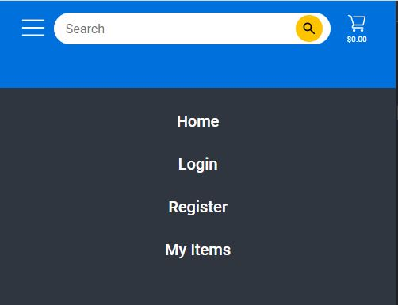

# Vue 3 + TypeScript + Vite
- This is a Client-api build with Vue3.

## Tecnologies that I used
- Typescript
- Vue3 with Vue-router version 4
- SASS
- Pinia and plugin(pinia-plugin-persistedstate) to persist the state
- Axios with async await

## Screenshot




## Axios with Vuejs Composition API example
```ts
import axios from "axios";
import { ref } from "vue"

let email = ref("")
let password = ref("")

const HandleSubmit = async () => {
    const res = await axios.post("http://localhost:3000/auth/login",{
        email: email.value,
        password:password.value
    })
    console.log(res)
    console.log(res.data.token)
}
```
```html
    <form @submit.prevent="HandleSubmit" class="form-container">
        <p class="input-form">
            <input type="email" name="email" id="email" placeholder="Enter your email" v-model="email">
        </p>
        <p class="input-form">
            <input type="password" name="password" id="password" placeholder="******" v-model="password">
        </p>
        <button>Save</button>
    </form>
```

## How Protect routes with Vue-router-4 and pinia
```ts
import { createRouter, createWebHistory } from "vue-router";
import { useAuthStore } from "../store/auth.state";

const router = createRouter({
  history: createWebHistory(),
  routes: [
    {
      path: "/login",
      name: "Login",
      component: () => import("../views/LoginView.vue"),
    },
    {
      path: "/compras",
      name: "Compras",
      component: () => import("../views/Comprasview.vue"),
      meta: { requiresAuth: true },
    },
  ],
});

router.beforeEach((to,from)=> {
  const main = useAuthStore()
  if (to.meta.requiresAuth && !main.isAllowed) {
    // this route requires auth, check if logged in
    // if not, redirect to login page.
    return {
      path: "/login",
      // save the location we were at to come back later
      query: { redirect: to.fullPath },
    };
  }
})

export default router;

```

## Menu responsive with Sass, Vuejs Composition API(ref)
```ts
import { ref } from "vue";
let active = ref(false);
```
```html
<div class="menu">
                <label class="checkbtn">
                    <Icon v-on:click="active = !active"
                        icon="clarity:bars-line" width="3.4rem" />
                </label>
                <ul v-bind:class="{ show: active }">
                    <li v-on:click="active = !active" ><router-link to="/">Home</router-link></li>
                    <li v-on:click="active = !active" ><router-link to="/login">Login</router-link></li>
                    <li v-on:click="active = !active" ><router-link to="/register" >Register</router-link>
                    </li>
                    <li v-on:click="active = !active" ><router-link to="/shopping">My Items</router-link></li>
                </ul>
            </div>
```
```scss
.menu {
  display: none;
  a {
    color: white;
    font-size: 1.6rem;
    margin-left: 1vw;
    font-weight: 500;
    display: flex;
    align-items: center;
  }
}

@media (max-width: 1100px) {
    .navigation {
            .menu {
                a {
                    justify-content: center;
                    margin: 3rem auto;
                    color: white;
                    font-size: 2rem;

                    &:active {
                        color: #0071dc;
                    }
                }

                display: block;

                .checkbtn {
                    display: block;
                    cursor: pointer;
                }

                .show {
                    left: -100%;
                }

                ul {
                    position: fixed;
                    width: 100%;
                    height: 100vh;
                    background-color: #2f3640;
                    top: 11rem;
                    left: 0;
                    transition: all .5s;

                    li {
                        display: block;
                    }
                }
            }
    }
}
```